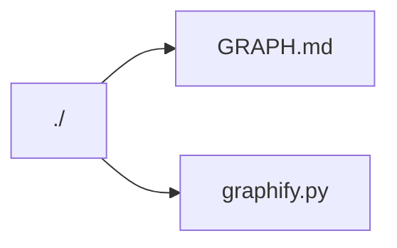
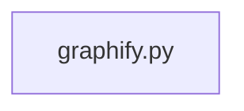

# NexLexHub Graph

Generated by `tools/graphify.py`.

## Summary

- Repo tree: 3 nodes, 2 edges
- Python imports: 1 files, 0 edges

## Repo Tree (filtered)

## Python Import Graph (internal only)

